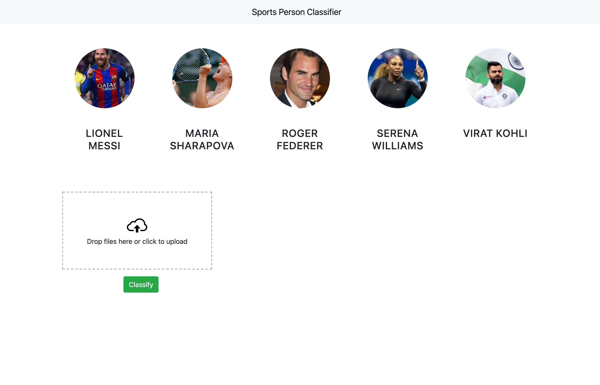
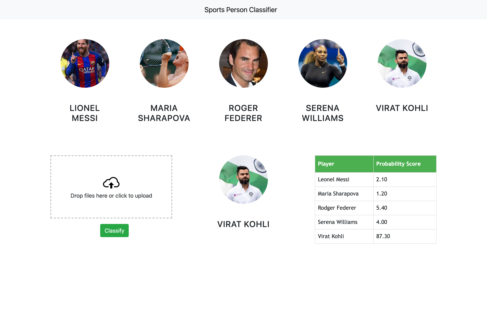

# Sports Celebrity Image Classifier

A full-stack computer-vision project that classifies a face image into one of five sports celebrities using OpenCV preprocessing, wavelet features, and a trained scikit-learn model. It ships with a Flask API and a static web UI for easy image upload and result visualization.

## Contents
1. Overview
2. Screenshots
3. Features
4. Tech Stack
5. Supported Classes
6. Architecture
7. Project Structure
8. Setup
9. Running the App
10. API Reference
11. Model Training
12. Artifacts
13. Sample Images
14. Configuration
15. Troubleshooting
16. License

## Overview
- Upload an image through the web UI and get the predicted class with per-class probabilities.
- The backend accepts a base64-encoded image and returns JSON with model output.
- Face detection requires at least two detected eyes to improve reliability.

## Screenshots



## Features
- Face and eye detection using OpenCV Haar cascades.
- Robust cropping that keeps only faces with at least two detected eyes.
- Wavelet-transform features combined with raw pixel features.
- Flask API with CORS enabled for browser clients.
- Static web UI with Dropzone-based image upload.

## Tech Stack
- Python, Flask, gunicorn
- OpenCV, NumPy, PyWavelets
- scikit-learn, joblib
- HTML, CSS, JavaScript, Bootstrap, Dropzone, jQuery

## Supported Classes
- `lionel_messi`
- `maria_sharapova`
- `roger_federer`
- `serena_williams`
- `virat_kohli`

## Architecture
- UI: Static HTML/CSS/JS with Bootstrap and Dropzone for drag-and-drop uploads.
- API: Flask endpoint `/classify_image` accepts base64 image data.
- Preprocessing: Face detection + eye detection; crops faces with at least two eyes.
- Features: 32x32 raw pixels plus wavelet (db1, level 5) features.
- Model: Trained scikit-learn classifier stored in `server/artifacts`.
- Output: Top predicted class and per-class probability scores.

## Project Structure
```
.
├── UI
│   ├── index.html
│   ├── app.js
│   ├── app.css
│   ├── dropzone.min.js
│   ├── dropzone.min.css
│   ├── images
│   └── test_images
├── server
│   ├── server.py
│   ├── util.py
│   ├── wavelet.py
│   ├── artifacts
│   │   ├── b64.txt
│   │   ├── class_dictionary.json
│   │   ├── save_model.pkl
│   │   └── test_images
│   └── opencv
│       └── haarcascades
├── model
│   ├── data_cleaning.ipynb
│   ├── sports_celebrity_classification.ipynb
│   ├── class_dictionary.json
│   ├── save_model.pkl
│   ├── dataset
│   └── test_images
├── docs
│   └── screenshots
├── requirements.txt
├── model/requirements.txt
├── LICENSE
└── README.md
```

## Setup
1. Create and activate a virtual environment.
```
python -m venv .venv
source .venv/bin/activate
```
2. Install runtime dependencies.
```
pip install -r requirements.txt
```
3. Install notebook dependencies if you plan to retrain or explore the model.
```
pip install -r model/requirements.txt
```

## Running the App
### Start the API server
```
python server/server.py
```
The API will start on `http://127.0.0.1:5000`.

### Run the web UI
Open `UI/index.html` directly in a browser, or serve the folder locally.
```
cd UI
python -m http.server 8000
```
Then visit `http://127.0.0.1:8000/index.html`.

## API Reference
### Endpoint
`POST /classify_image`

### Form Data
- `image_data`: base64 data URL (example: `data:image/jpeg;base64,...`)

### Response (example)
```
[
  {
    "class": "virat_kohli",
    "class_probability": [1.05, 12.67, 22.0, 4.5, 91.56],
    "class_dictionary": {
      "lionel_messi": 0,
      "maria_sharapova": 1,
      "roger_federer": 2,
      "serena_williams": 3,
      "virat_kohli": 4
    }
  }
]
```

## Model Training
- `model/data_cleaning.ipynb`: explores face/eye detection and generates clean crops.
- `model/sports_celebrity_classification.ipynb`: feature extraction, model training, and evaluation.
- Trained artifacts are saved to `server/artifacts` for inference.

## Artifacts
- `server/artifacts/save_model.pkl`: serialized scikit-learn model.
- `server/artifacts/class_dictionary.json`: label mapping used at inference time.
- `server/artifacts/b64.txt`: sample base64 payload for quick local tests.
- `server/artifacts/test_images`: small test image set for sanity checks.

## Sample Images
- `UI/test_images`: quick images to drag-and-drop in the UI.
- `server/artifacts/test_images`: local images used in utility smoke tests.

## Configuration
- The UI currently posts to a hosted backend defined in [`UI/app.js`](UI/app.js): `https://backend-image-classification-tsta.onrender.com/classify_image`.
- To use the local Flask server, update the `url` variable to:
```
http://127.0.0.1:5000/classify_image
```
- If the API host changes, the UI must be updated accordingly.

## Troubleshooting
- Empty results usually mean no face or fewer than two eyes were detected.
- Ensure the model file exists in `server/artifacts` and is named `save_model.pkl` or `saved_model.pkl`.
- If the UI cannot reach the API, confirm the backend is running and CORS is allowed.

## License
MIT License

Copyright (c) 2026 Sourav Das

Permission is hereby granted, free of charge, to any person obtaining a copy
of this software and associated documentation files (the "Software"), to deal
in the Software without restriction, including without limitation the rights
to use, copy, modify, merge, publish, distribute, sublicense, and/or sell
copies of the Software, and to permit persons to whom the Software is
furnished to do so, subject to the following conditions:

The above copyright notice and this permission notice shall be included in all
copies or substantial portions of the Software.

THE SOFTWARE IS PROVIDED "AS IS", WITHOUT WARRANTY OF ANY KIND, EXPRESS OR
IMPLIED, INCLUDING BUT NOT LIMITED TO THE WARRANTIES OF MERCHANTABILITY,
FITNESS FOR A PARTICULAR PURPOSE AND NONINFRINGEMENT. IN NO EVENT SHALL THE
AUTHORS OR COPYRIGHT HOLDERS BE LIABLE FOR ANY CLAIM, DAMAGES OR OTHER
LIABILITY, WHETHER IN AN ACTION OF CONTRACT, TORT OR OTHERWISE, ARISING FROM,
OUT OF OR IN CONNECTION WITH THE SOFTWARE OR THE USE OR OTHER DEALINGS IN THE
SOFTWARE.
